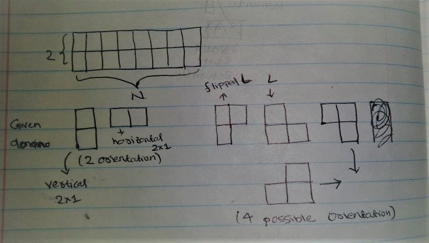
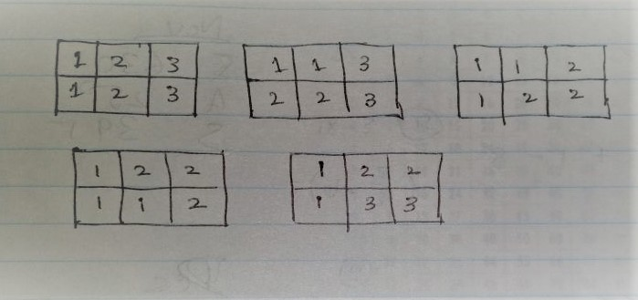
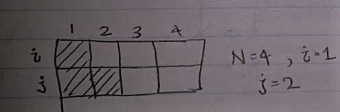
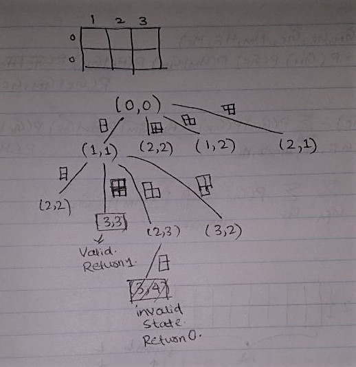

[Problem to the Link - LeetCode](https://leetcode.com/problems/domino-and-tromino-tiling/description/)

Let's understand the problem. 
You are given few tiles of shape (2x1) and L shaped. See picture below. 

We have to fill the 2xN floor using the given tiles (2x1 and L shaped). We are allowed to rotate the tiles in any direction wanted as shown in above picture. Questions asks us to find number of ways we can fill this 2xN floor by laying tiles. There can't be any missed cell on the floor. For N=3, we will have 5 different combinations. See below for clarifications. In the picture, same number make one tile and numbering is done for visualization only. 

## Recursive Solution

Let's try to fill the floor from left to right. 
For understanding I will number the floor's column as 1,2,3,.....N from left to right. Now <b>i</b> represents row1 and <b>j</b> represents row2.  
While we are laying tiles, <b>i</b> represents the column till which 1st row has been laid tiles with. Similarly <b>j</b> for second column. See the picture for clear understanding of representation.

Now when i==j, we have 4 choices to put a tile. 

1. Put 1 tile vertically. So this will change (i,j) to (i+1,j+1). Because with putting one vertical tile, we will cover 1 extra column. 
2. Put 2 tiles horizontally. 
    We can't put only 1 tile horizontally, it will increase the |i-j| dist by 2, which can only be filled by a 2x1 tile horizontally. (Bit confusing, but think through.)
3. Put 1 L shaped tile. (i,j) -> (i,j+1)
4. Put 1 flipping L shaped tile upside down. (i,j) -> (i+1,j)

Now when |i-j|==1, we have 2 choice.  
1. We put one L shaped domino. (i+1,j) -> (i+2, j+2) or (i,j+1) -> (i+2,j+2) 
2. We put one horizontal 2x1 tile. (i+1,j) -> (i+1,j+2) or (i,j+1) -> (i+2,j+1) 

If |i-j|>=2, this is an invalid solution. In this case there is no way we can fill the floor with tiles. Remember, in our recursion condition we're ensuring we won't reach this state where |i-j|>=2. 
 

Base case: 
if i>N or j>N : count is 0, it would be an invalid state. 
if i==N or j==N : count will be increased by 1.  

Now for each repeating recursion(i,j) we can memorize the number for path and use dynamic programming. That is a straigt forward code change.

Code Snippet:

        class Solution {
            const long mod = 1e9+7;
        public:
            int numTilings(int N) {
                vector<vector<long>> dp(N+1, vector<long>(N+1,-1));
                return rec(0,0,N,dp);
            }
            long rec(int i,int j,int N,vector<vector<long>>& dp) {
                if(i==N && j==N) return 1;
                if(i>N || j>N) return 0;
                
                if(dp[i][j]!=-1) return dp[i][j];
                long ans = 0;
                
                if(i==j) {
                    long ans1 = rec(i+1,j+1,N,dp);
                    long ans2 = rec(i+2,j+2,N,dp);
                    long ans3 = rec(i+2,j+1,N,dp);
                    long ans4 = rec(i+1,j+2,N,dp);
                    ans = ans1+ans2+ans3+ans4;
                }
                else if(i-j==1) {
                    long ans1 = rec(i+1,j+2,N,dp);
                    long ans2 = rec(i,j+2,N,dp);
                    ans = ans1+ans2;
                }
                else if(j-i==1) {
                    long ans1 = rec(i+2,j+1,N,dp);
                    long ans2 = rec(i+2,j,N,dp);
                    ans = ans1+ans2;
                }
                else {
                    ans=0;
                }
                dp[i][j] = ans%mod;
                return ans%mod;
            }
        };

A subset of Recursion Graph:

